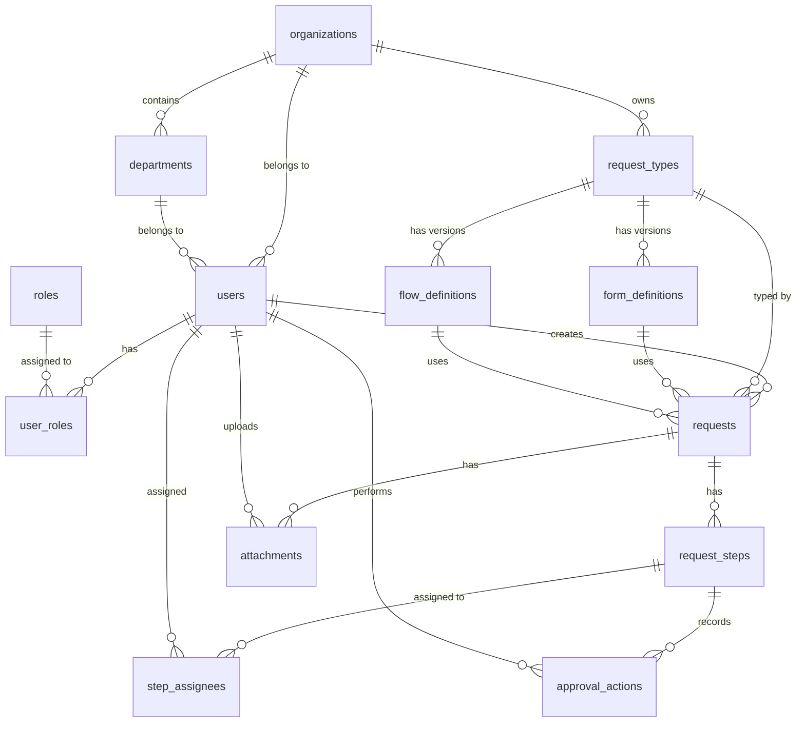

# Database Schema Design

申請・承認ワークフローシステムのデータベーススキーマ設計書です。実際のPrismaスキーマは後続エピックで段階的に実装します。

## ER図



## テーブル定義

### 組織・ユーザー管理

#### organizations（組織・テナント）

マルチテナント対応。各組織は独立したデータ空間を持つ。

| Column | Type | Constraints | Description |
|--------|------|-------------|-------------|
| id | String | PK | 組織ID (cuid) |
| name | String | NOT NULL | 組織名 |
| slug | String | UNIQUE, NOT NULL | URL用識別子 |
| settings | JSON | NULL | 組織設定（タイムゾーン、言語等） |
| created_at | DateTime | NOT NULL | 作成日時 |
| updated_at | DateTime | NOT NULL | 更新日時 |

**インデックス**:
- PRIMARY KEY (id)
- UNIQUE INDEX (slug)

---

#### departments（部門）

組織内の部門構造。階層構造は将来実装予定。

| Column | Type | Constraints | Description |
|--------|------|-------------|-------------|
| id | String | PK | 部門ID (cuid) |
| organization_id | String | FK → organizations | 所属組織 |
| name | String | NOT NULL | 部門名 |
| parent_id | String | FK → departments, NULL | 親部門（階層構造用） |
| created_at | DateTime | NOT NULL | 作成日時 |
| updated_at | DateTime | NOT NULL | 更新日時 |

**インデックス**:
- PRIMARY KEY (id)
- INDEX (organization_id, parent_id)

---

#### users（ユーザー）

システムユーザー。JWT認証用のクレデンシャルも管理。

| Column | Type | Constraints | Description |
|--------|------|-------------|-------------|
| id | String | PK | ユーザーID (cuid) |
| organization_id | String | FK → organizations | 所属組織 |
| department_id | String | FK → departments, NULL | 所属部門 |
| email | String | UNIQUE, NOT NULL | メールアドレス |
| password_hash | String | NOT NULL | パスワードハッシュ (bcrypt) |
| name | String | NOT NULL | 氏名 |
| is_active | Boolean | NOT NULL, DEFAULT true | アクティブフラグ |
| created_at | DateTime | NOT NULL | 作成日時 |
| updated_at | DateTime | NOT NULL | 更新日時 |

**インデックス**:
- PRIMARY KEY (id)
- UNIQUE INDEX (email)
- INDEX (organization_id, department_id)

---

#### roles（ロール）

組織ごとのロール定義。承認者判定に使用。

| Column | Type | Constraints | Description |
|--------|------|-------------|-------------|
| id | String | PK | ロールID (cuid) |
| organization_id | String | FK → organizations | 所属組織 |
| name | String | NOT NULL | ロール名（例: "上長", "経理担当"） |
| slug | String | NOT NULL | 識別子 |
| description | String | NULL | 説明 |
| created_at | DateTime | NOT NULL | 作成日時 |
| updated_at | DateTime | NOT NULL | 更新日時 |

**インデックス**:
- PRIMARY KEY (id)
- UNIQUE INDEX (organization_id, slug)

---

#### user_roles（ユーザーロール）

ユーザーとロールの多対多関係。

| Column | Type | Constraints | Description |
|--------|------|-------------|-------------|
| id | String | PK | ID (cuid) |
| user_id | String | FK → users | ユーザー |
| role_id | String | FK → roles | ロール |
| created_at | DateTime | NOT NULL | 付与日時 |

**インデックス**:
- PRIMARY KEY (id)
- UNIQUE INDEX (user_id, role_id)
- INDEX (role_id)

---

### 申請タイプ・版管理

#### request_types（申請タイプ）

申請の種類（出張申請、経費申請など）を定義。

| Column | Type | Constraints | Description |
|--------|------|-------------|-------------|
| id | String | PK | 申請タイプID (cuid) |
| organization_id | String | FK → organizations | 所属組織 |
| name | String | NOT NULL | 申請タイプ名 |
| slug | String | NOT NULL | 識別子 |
| description | String | NULL | 説明 |
| is_active | Boolean | NOT NULL, DEFAULT true | 有効フラグ |
| published_form_version | Int | NULL | 公開中のフォーム版番号 |
| published_flow_version | Int | NULL | 公開中のフロー版番号 |
| created_at | DateTime | NOT NULL | 作成日時 |
| updated_at | DateTime | NOT NULL | 更新日時 |

**インデックス**:
- PRIMARY KEY (id)
- UNIQUE INDEX (organization_id, slug)
- INDEX (organization_id, is_active)

---

#### form_definitions（フォーム定義）

JSON Schemaベースの動的フォーム定義。版管理対応。

| Column | Type | Constraints | Description |
|--------|------|-------------|-------------|
| id | String | PK | フォーム定義ID (cuid) |
| request_type_id | String | FK → request_types | 申請タイプ |
| version | Int | NOT NULL | 版番号 |
| schema | JSON | NOT NULL | JSON Schema形式のフォーム定義 |
| ui_schema | JSON | NULL | UI表示用の追加設定 |
| is_draft | Boolean | NOT NULL, DEFAULT true | 下書きフラグ |
| created_by | String | FK → users | 作成者 |
| created_at | DateTime | NOT NULL | 作成日時 |
| updated_at | DateTime | NOT NULL | 更新日時 |

**インデックス**:
- PRIMARY KEY (id)
- UNIQUE INDEX (request_type_id, version)
- INDEX (request_type_id, is_draft)

**バージョン管理戦略**:
- 新規作成時は`is_draft = true`で作成
- 公開時に`request_types.published_form_version`を更新
- 過去バージョンは削除せず保持（申請データとの紐付けのため）

---

#### flow_definitions（承認フロー定義）

承認フローの定義。ステップ、担当ロール、並列/順次を管理。

| Column | Type | Constraints | Description |
|--------|------|-------------|-------------|
| id | String | PK | フロー定義ID (cuid) |
| request_type_id | String | FK → request_types | 申請タイプ |
| version | Int | NOT NULL | 版番号 |
| steps | JSON | NOT NULL | ステップ定義の配列 |
| is_draft | Boolean | NOT NULL, DEFAULT true | 下書きフラグ |
| created_by | String | FK → users | 作成者 |
| created_at | DateTime | NOT NULL | 作成日時 |
| updated_at | DateTime | NOT NULL | 更新日時 |

**steps JSON構造例**:
```json
[
  {
    "order": 1,
    "name": "上長承認",
    "required_role_slugs": ["manager"],
    "parallel": false
  },
  {
    "order": 2,
    "name": "経理承認",
    "required_role_slugs": ["accounting"],
    "parallel": false
  }
]
```

**インデックス**:
- PRIMARY KEY (id)
- UNIQUE INDEX (request_type_id, version)
- INDEX (request_type_id, is_draft)

---

### 申請・承認プロセス

#### requests（申請）

実際の申請レコード。

| Column | Type | Constraints | Description |
|--------|------|-------------|-------------|
| id | String | PK | 申請ID (cuid) |
| organization_id | String | FK → organizations | 所属組織 |
| request_type_id | String | FK → request_types | 申請タイプ |
| requester_id | String | FK → users | 申請者 |
| form_version | Int | NOT NULL | 使用フォーム版番号 |
| flow_version | Int | NOT NULL | 使用フロー版番号 |
| form_data | JSON | NOT NULL | 申請データ（JSON） |
| status | Enum | NOT NULL | ステータス（draft, submitted, in_review, approved, rejected, returned, withdrawn, completed） |
| current_step | Int | NULL | 現在の承認ステップ順序 |
| submitted_at | DateTime | NULL | 提出日時 |
| approved_at | DateTime | NULL | 承認完了日時 |
| completed_at | DateTime | NULL | 完了日時 |
| created_at | DateTime | NOT NULL | 作成日時 |
| updated_at | DateTime | NOT NULL | 更新日時 |

**インデックス**:
- PRIMARY KEY (id)
- INDEX (organization_id, requester_id, status)
- INDEX (request_type_id, status, created_at DESC)
- INDEX (status, updated_at DESC)

---

#### request_steps（承認ステップインスタンス）

申請ごとの承認ステップ実体。フロー定義から展開される。

| Column | Type | Constraints | Description |
|--------|------|-------------|-------------|
| id | String | PK | ステップID (cuid) |
| request_id | String | FK → requests | 申請 |
| step_order | Int | NOT NULL | ステップ順序 |
| step_name | String | NOT NULL | ステップ名 |
| status | Enum | NOT NULL | pending, in_progress, approved, rejected, returned, skipped |
| is_parallel | Boolean | NOT NULL | 並列承認フラグ |
| created_at | DateTime | NOT NULL | 作成日時 |
| updated_at | DateTime | NOT NULL | 更新日時 |

**インデックス**:
- PRIMARY KEY (id)
- UNIQUE INDEX (request_id, step_order)
- INDEX (request_id, status)

---

#### step_assignees（ステップ担当者）

承認ステップの担当者。ロール解決結果。

| Column | Type | Constraints | Description |
|--------|------|-------------|-------------|
| id | String | PK | ID (cuid) |
| step_id | String | FK → request_steps | ステップ |
| user_id | String | FK → users | 担当者 |
| role_id | String | FK → roles | 割当根拠のロール |
| status | Enum | NOT NULL | pending, approved, rejected, returned |
| created_at | DateTime | NOT NULL | 作成日時 |
| updated_at | DateTime | NOT NULL | 更新日時 |

**インデックス**:
- PRIMARY KEY (id)
- UNIQUE INDEX (step_id, user_id)
- INDEX (user_id, status)

---

#### approval_actions（承認アクション・監査ログ）

すべての承認操作を記録。監査証跡。

| Column | Type | Constraints | Description |
|--------|------|-------------|-------------|
| id | String | PK | アクションID (cuid) |
| request_id | String | FK → requests | 申請 |
| step_id | String | FK → request_steps | ステップ |
| user_id | String | FK → users | 実行者 |
| action | Enum | NOT NULL | approve, reject, return |
| comment | String | NULL | コメント（却下・差戻し時は必須） |
| created_at | DateTime | NOT NULL | 実行日時 |

**インデックス**:
- PRIMARY KEY (id)
- INDEX (request_id, created_at DESC)
- INDEX (user_id, created_at DESC)
- INDEX (step_id)

---

### 添付ファイル管理

#### attachments（添付ファイル）

申請に添付されたファイルのメタデータ。実体はS3/MinIOに保存。

| Column | Type | Constraints | Description |
|--------|------|-------------|-------------|
| id | String | PK | 添付ファイルID (cuid) |
| request_id | String | FK → requests | 申請 |
| uploaded_by | String | FK → users | アップロード者 |
| file_name | String | NOT NULL | ファイル名 |
| file_size | Int | NOT NULL | ファイルサイズ（bytes） |
| mime_type | String | NOT NULL | MIMEタイプ |
| storage_key | String | NOT NULL | ストレージ上のキー（S3 key） |
| storage_bucket | String | NOT NULL | ストレージバケット名 |
| created_at | DateTime | NOT NULL | アップロード日時 |

**インデックス**:
- PRIMARY KEY (id)
- INDEX (request_id)
- INDEX (uploaded_by)

**セキュリティ考慮**:
- ファイルは署名付きURLでアップロード
- ダウンロードも署名付きURLで提供（権限チェック後）
- 許可する拡張子・MIMEタイプを制限
- 最大ファイルサイズ制限（環境変数で設定）

---

### 冪等性制御

#### idempotency_keys（冪等性キー）

重要な変更操作の二重実行防止。

| Column | Type | Constraints | Description |
|--------|------|-------------|-------------|
| id | String | PK | ID (cuid) |
| key | String | UNIQUE, NOT NULL | Idempotency-Keyヘッダーの値 |
| request_path | String | NOT NULL | APIエンドポイントパス |
| request_method | String | NOT NULL | HTTPメソッド |
| user_id | String | FK → users | 実行者 |
| response_status | Int | NOT NULL | レスポンスHTTPステータス |
| response_body | JSON | NULL | レスポンスボディ（再利用用） |
| created_at | DateTime | NOT NULL | 初回実行日時 |
| expires_at | DateTime | NOT NULL | 有効期限（24時間など） |

**インデックス**:
- PRIMARY KEY (id)
- UNIQUE INDEX (key)
- INDEX (user_id, created_at DESC)
- INDEX (expires_at) -- 期限切れレコード削除用

**運用**:
- POST/PUT/DELETE等の変更操作でIdempotency-Keyヘッダーを必須化
- 同一キーでの再実行時は保存済みレスポンスを返却
- 期限切れレコードは定期的にクリーンアップ

---

## インデックス設計方針

### パフォーマンス重視のインデックス
- **一覧取得**: (organization_id, status, created_at DESC)
- **担当者フィルタ**: (user_id, status)
- **タイプ別フィルタ**: (request_type_id, status)

### 整合性チェック用インデックス
- ユニーク制約: 重複データ防止
- 外部キーインデックス: JOIN性能向上

### 監査ログ検索用
- (request_id, created_at DESC): 申請履歴表示
- (user_id, created_at DESC): ユーザー操作履歴

---

## データ保持ポリシー

### 論理削除 vs 物理削除
- **論理削除**: users, departments (is_activeフラグ)
- **物理削除なし**: requests, approval_actions (監査証跡として永続保持)
- **期限付き削除**: idempotency_keys (24時間後に削除)

### アーカイブ戦略（将来実装）
- 完了から1年以上経過した申請は別テーブルへ移動
- 監査ログは7年間保持（法的要件に応じて調整）

---

## 段階的実装計画

このスキーマ設計は全体像を示したものです。実際のPrismaスキーマ実装は以下の順序で行います：

### エピック3: RBAC/組織管理
- organizations
- departments
- users
- roles
- user_roles

### エピック4: 申請タイプ・版管理
- request_types
- form_definitions
- flow_definitions

### エピック5: 申請作成・提出
- requests
- attachments

### エピック6: 承認ワークフロー
- request_steps
- step_assignees
- approval_actions

### エピック8: 冪等性制御
- idempotency_keys
