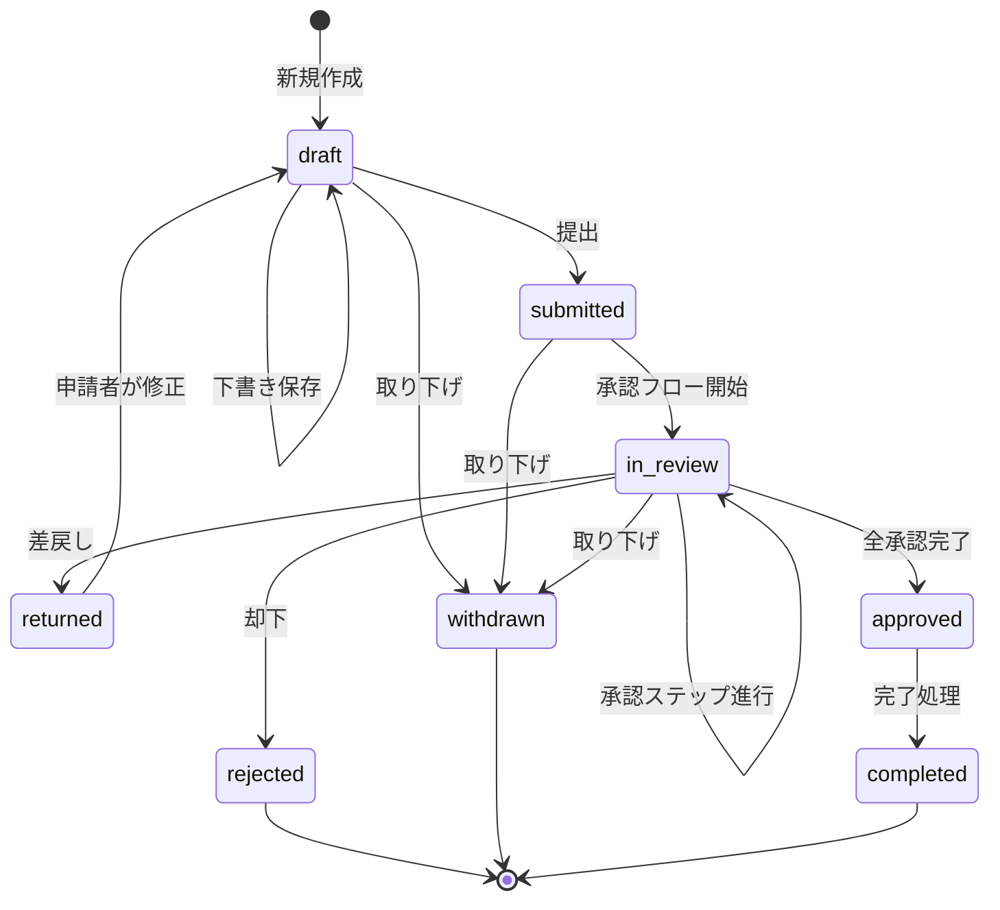
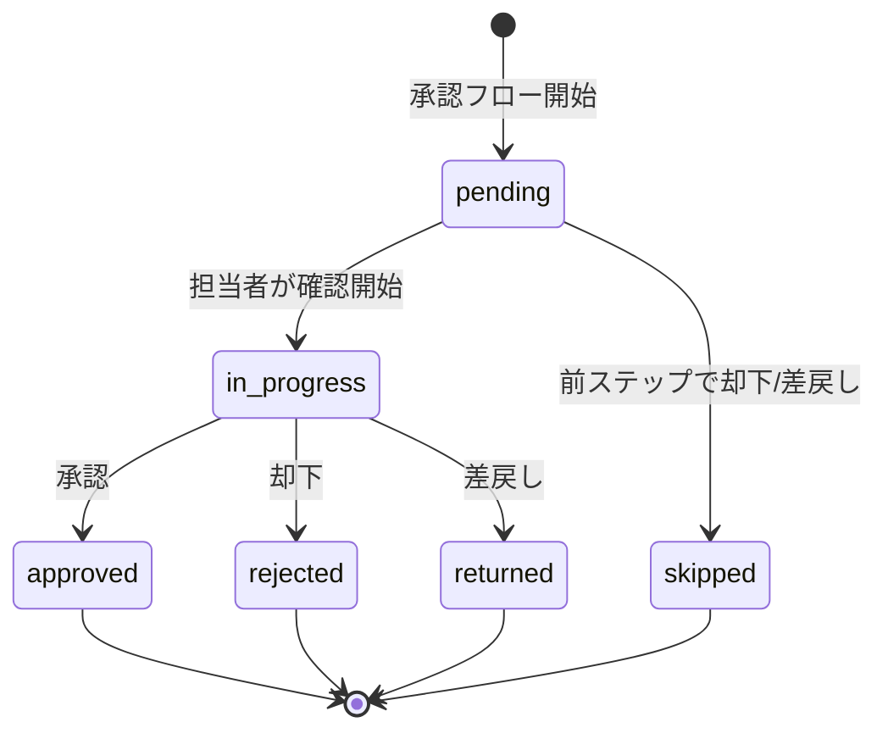
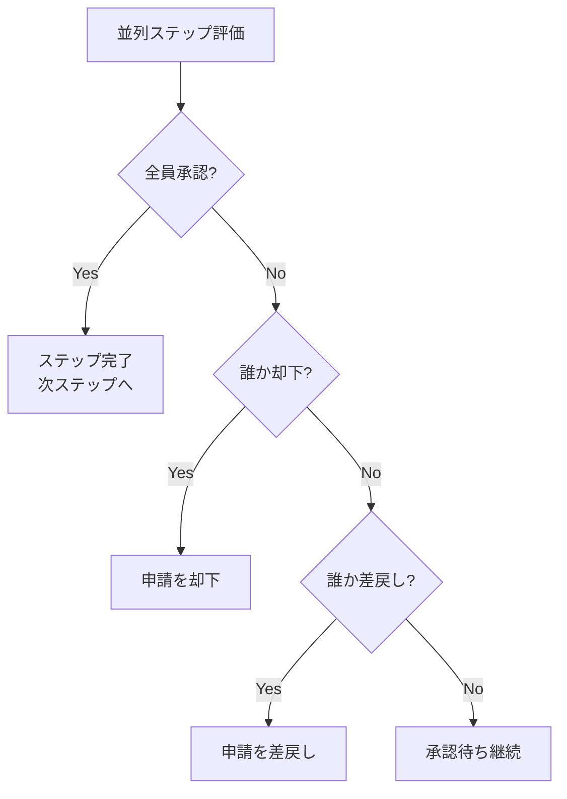
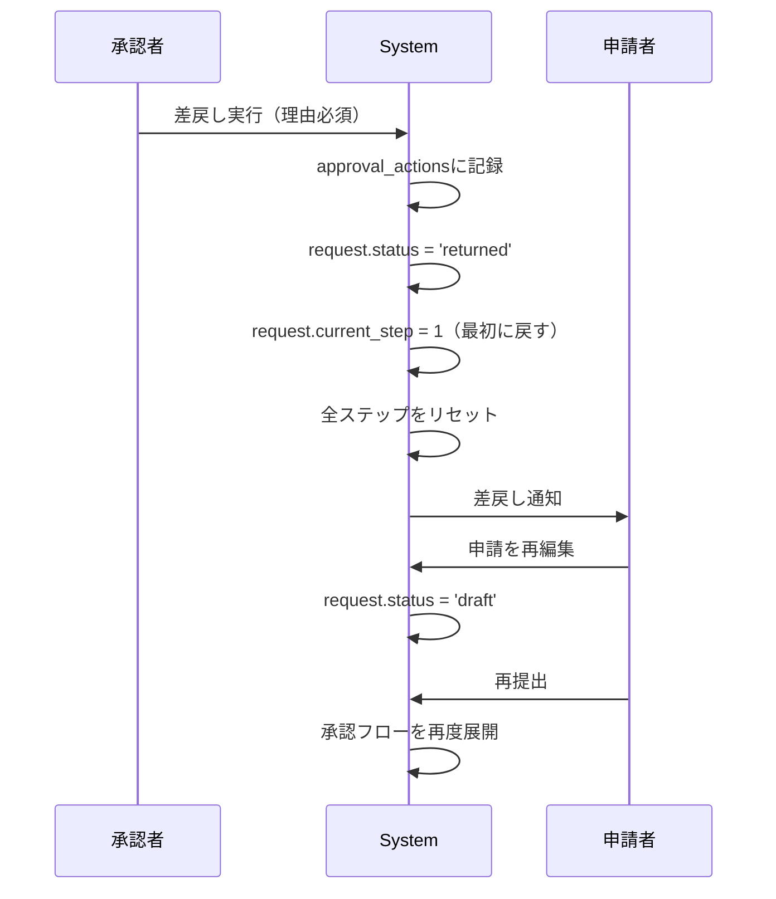

# Workflow States

申請・承認ワークフローの状態遷移を定義します。

## 申請ステータス遷移

申請（Request）は以下のステータスを持ちます。

### ステータス定義

| Status | 説明 | 遷移可能な次ステータス |
|--------|------|---------------------|
| `draft` | 下書き | submitted, withdrawn |
| `submitted` | 提出済み（承認フロー未開始） | in_review, withdrawn |
| `in_review` | 承認中 | approved, rejected, returned, withdrawn |
| `returned` | 差戻し | draft |
| `approved` | 承認完了 | completed |
| `rejected` | 却下 | （終了状態） |
| `withdrawn` | 取り下げ | （終了状態） |
| `completed` | 完了 | （終了状態） |

### 遷移条件

#### draft → submitted
- 条件: フォームバリデーション成功
- アクション:
  - 申請レコード作成
  - 使用するフォーム・フロー定義版番号を固定
  - ステータスを`submitted`に設定

#### submitted → in_review
- 条件: 承認フローが定義されている
- アクション:
  - 承認フロー定義から`request_steps`を展開
  - 各ステップの担当者を`step_assignees`に展開
  - 最初のステップを`pending`に設定
  - ステータスを`in_review`に変更

#### in_review → approved
- 条件: すべての承認ステップが`approved`
- アクション:
  - ステータスを`approved`に変更
  - 承認完了日時を記録

#### in_review → rejected
- 条件: いずれかのステップで却下
- アクション:
  - ステータスを`rejected`に変更
  - 却下理由を記録

#### in_review → returned
- 条件: 承認者が差戻しを実行
- アクション:
  - ステータスを`returned`に変更
  - 差戻し理由を記録
  - `current_step`を最初のステップに戻す（または指定ステップに）

#### returned → draft
- 条件: 申請者が再編集を開始
- アクション:
  - ステータスを`draft`に変更
  - 承認ステップをリセット

#### approved → completed
- 条件: システム管理者または自動処理
- アクション:
  - ステータスを`completed`に変更
  - 完了日時を記録

## 承認ステップ遷移

承認ステップ（RequestStep）は以下のステータスを持ちます。

### ステップステータス定義

| Status | 説明 | 遷移可能な次ステータス |
|--------|------|---------------------|
| `pending` | 承認待ち | in_progress, skipped |
| `in_progress` | 確認中 | approved, rejected, returned |
| `approved` | 承認済み | （終了状態） |
| `rejected` | 却下 | （終了状態） |
| `returned` | 差戻し | （終了状態） |
| `skipped` | スキップ | （終了状態） |

### 並列承認の評価ロジック

同一ステップ順序（step_order）を持つステップは**並列承認**として扱われます。

#### 並列承認の完了条件
- **全員承認**: すべての担当者が`approved`
- **一人でも却下**: いずれかの担当者が`rejected` → ステップ全体が`rejected`
- **一人でも差戻し**: いずれかの担当者が`returned` → ステップ全体が`returned`

### 順次承認の評価ロジック

step_orderが異なるステップは順次実行されます。

1. step_order昇順で実行
2. 前ステップが`approved`になったら次ステップを`pending`に
3. 前ステップが`rejected`または`returned`なら後続ステップは`skipped`

## 差戻し処理詳細

### 差戻し時の処理フロー

### 差戻し先の決定

差戻しには2つのモードがあります：

1. **最初のステップに戻す**（デフォルト）
   - `current_step = 1`
   - 全承認ステップをリセット

2. **特定ステップに戻す**（将来実装予定）
   - 承認者が差戻し先ステップを指定
   - 指定ステップ以降をリセット

## 監査ログ

すべての承認アクション（承認・却下・差戻し）は`approval_actions`テーブルに記録されます。

### 記録内容
- **request_id**: 対象申請
- **step_id**: 対象ステップ
- **user_id**: アクション実行者
- **action**: 'approve', 'reject', 'return'
- **comment**: コメント（却下・差戻し時は必須）
- **created_at**: アクション日時

### 監査ログの用途
- 誰がいつ承認したかの追跡
- 却下・差戻し理由の記録
- コンプライアンス対応
- トラブルシューティング

## エラーケース処理

### 二重承認防止
- データベーストランザクション + 楽観的ロック
- ステップステータスが`pending`または`in_progress`の場合のみ更新可能

### 権限チェック
- 承認アクション実行前に担当者であることを確認
- `step_assignees.user_id`に含まれるユーザーのみ実行可能

### 不整合検知
- 申請ステータスが`in_review`でない場合は承認不可
- ステップの順序が前後している場合はエラー
